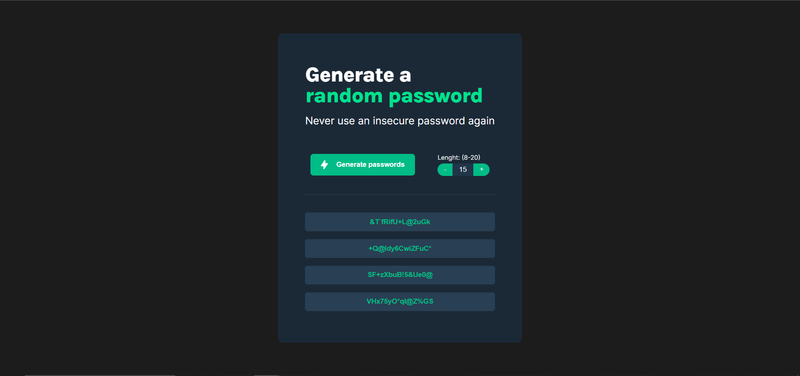
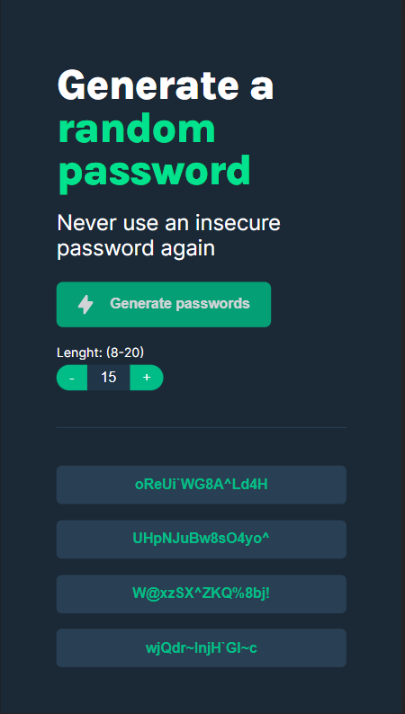

# PASSWORD GENERATOR

The password generator I built using HTML, CSS, and JavaScript is a straightforward tool designed to generate secure and random passwords for users. Its minimalist user interface focuses solely on the password generation feature, making it simple and efficient to use.

### Desktop Mode

### Mobile View

